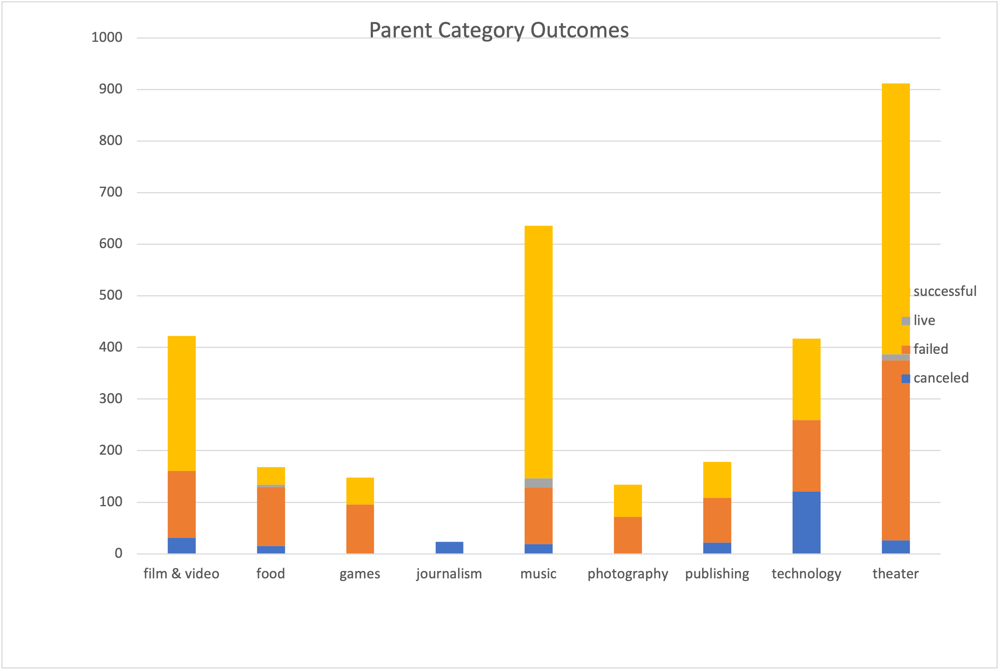
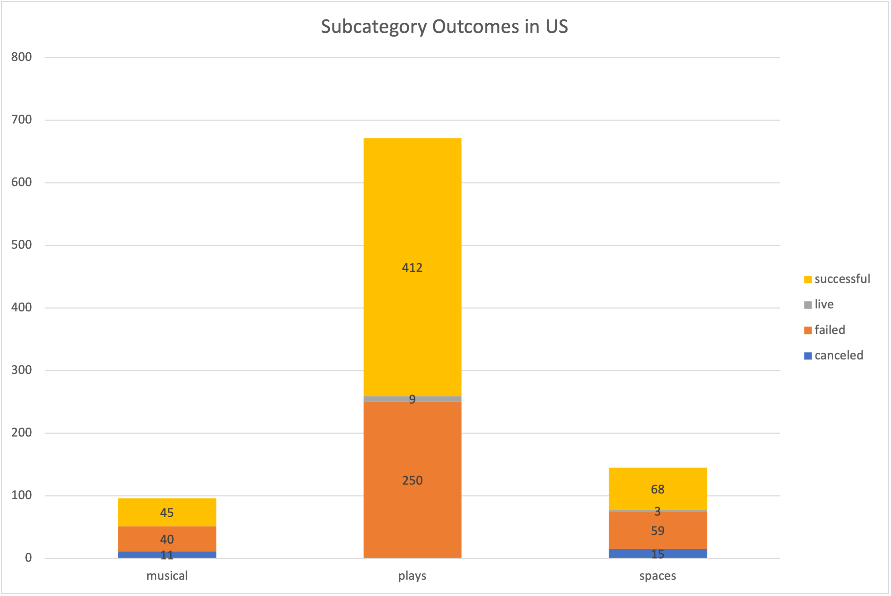

# Module-1-ExcelHW
Performing analysis on Kickstarter dataset to help Louise know the trends of funding goals.

## Overview of Project
Louise’s play Fever came close to its fundraising goal in a short amount of time. Now, she wants to know how different campaigns fared regarding their launch dates and funding goals. We visualized the campaign outcomes based on their launch dates and funding goals using the Kickstarter dataset. 
### Purpose
 We need to provide a visual summary of the data so that Louise can better understand the success rate of the campaigns based upon the launch date and goals.

## Analysis and Challenges
We need to understand the data types of the data. If required, we have to convert to readable data and organize it to generate insights based on the data, which helps in Louise's project. Here in this analysis, we have converted the Unix timestamps to a more readable date.
We have separated the categories and subcategories to analyze campaigns more efficiently.
- Based on the pivot table and chart, In the US ,the theaters campaigns were more successful. We can see 912 theaters campaigns; among them, 525 campaigns were successful.

- Further analysis based on the subcategory shows that there were musicals, plays, and spaces, but plays contributed more success than others. In the US, the play kickstarters success was 412 out of 671.

### Analysis of Outcomes Based on Launch Date
- The analysis based upon the launch date indicates more successful plays in May. However, June, July, and October had roughly the same number of failed campaigns launched. 
- In December, the number of successful campaigns was less.

### Analysis of Outcomes Based on Goals
Analysis based upon the Goals indicates that the goals less than 1000 were 76% more successful, and the goals around 45000 to 49000 mainly were unsuccessful. The success and failure percentage were the same when the goal is around 15000 to 19999. 

### Challenges and Difficulties Encountered
We need to sort and organize the data.
We need to apply filters to separate the parent and subcategory data.
When performing the formulas, more errors were encountered but could solve it.

### Conclusions Drawn from the Outcomes based on Launch Date
   - Launching the campaign in May and June was more successful.
   - The success rate of the campaign was less in December.
   - The length of the campaign should also be short for success.

### Conclusion Drawn from the Outcomes based on Goals?
   - The goals less than 1000 have higher success when compared to higher goals.

### Limitations of the dataset
  - The dataset was not in a readable format.
  - The Genre of the plays was not specified in the dataset ,it would be further helpful to analyze which type of plays were more liked by the people.

### Other possible tables and/or graphs that we could create
  - We can create stacked column charts for outcomes based on the date.
  - We can determine the statistical data based on mean, mode, and median and draw boxer plots based on it.
